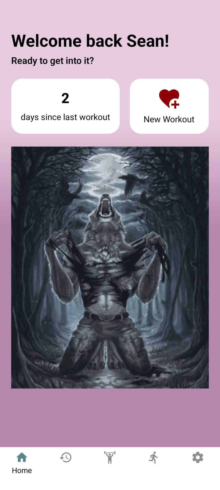
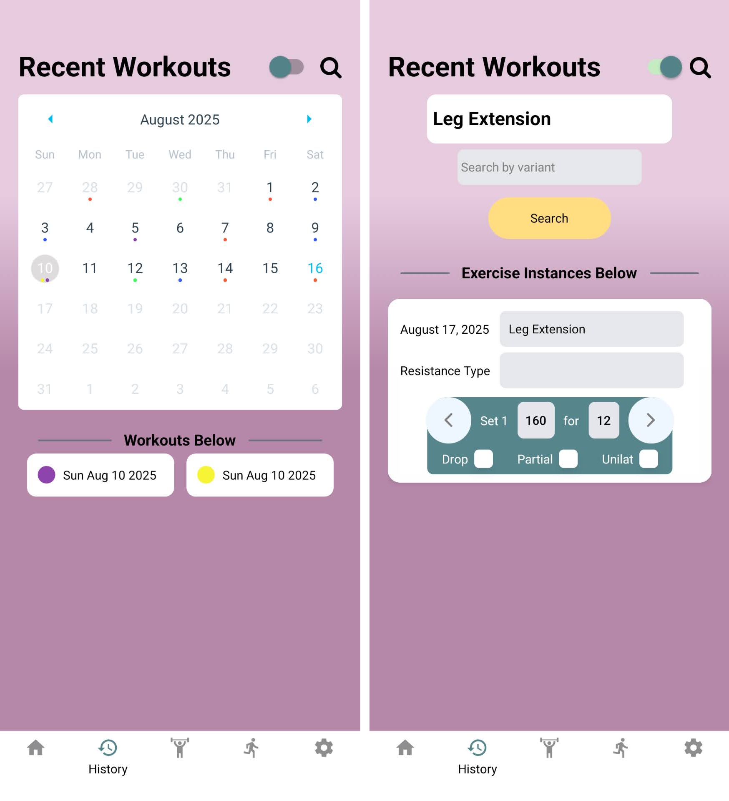
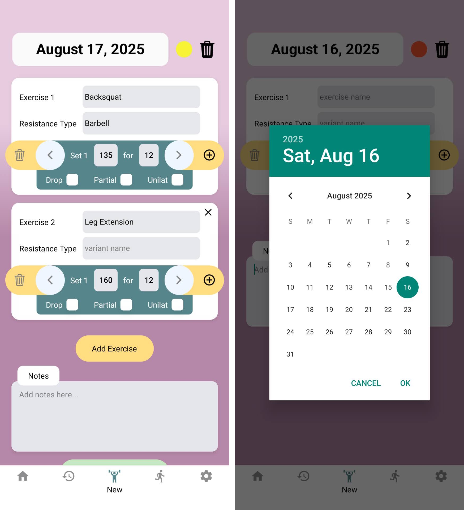
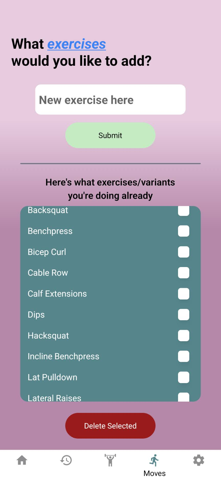
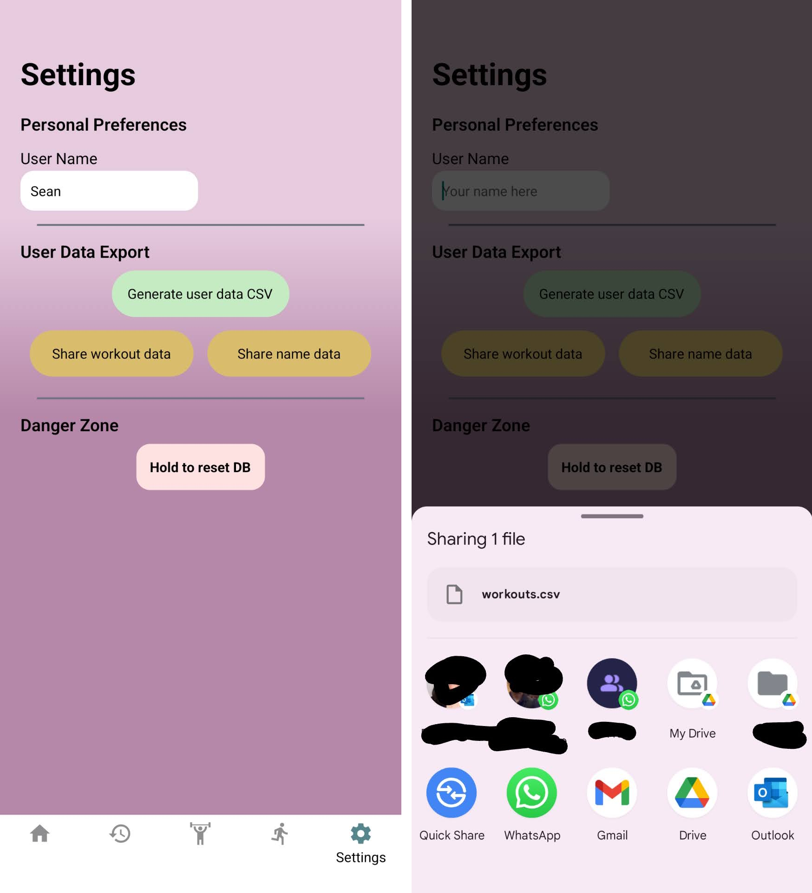

# Lift Log 💪
An offline mobile app for logging weightlifting training session to help with accumulating micro gains on a macro scale.

After using a Google form and its accompanying spread sheet for a year to log workouts I had collected several ideas for how I can log and search for information in more convenient ways. Some of the issues this app is meant to address are:
- encouraging more uniform input data
- more efficient inputting of data
- easy search for recent instances of doing a certain exercise

## Features
- Fully offline usability
- Log workout sessions with sets, reps, and modifiers (with intervaled autosave)
- Custom exercise (Bench Press, etc.) and variant selection (Barbell, Dumbbell, Cable, Machine, etc.)
- CSV export of logs and input exercise/variant selection
- Responsive UI with haptics

## Tech Stack
- React Native (Expo)
- Zustand state management
- SQLite and Async Storage for data persistence

## App Usage & Gallery

### Home
At the home screen you are greeted by a nice dog, and the number of days since your last entered workout, as well as a big button to start a new workout.

### History
Here a user can either select a date where a tag color is present, tap the preview, and view the full previously logged workout, or they can search for recent instances of an exercise they've been doing by tapping the toggle switch.

### New Workout
Users can adjust the date and tag color of the workout by tapping on the respective items to open modals, and then add in however many exercises they end up doing in that workout. To select an exercise/variant in each exercise tile, the user needs to tap on the box and keyword search for it, tapping then on the option that appears. If a user has not yet entered their sought for exercise/variant they can navigate to the 'Add Movements' tab, add it, and return afterwards. The purpose of this requirement of tapping on user-set options is to improve uniformity and consistency in logging.

### Add Movements & Variants
Here users can add to and delete from their personal lists of exercises and variation types they perform. To switch between viewing and modifying movements and variation types, the user can tap on the colored text.

### Settings
A user's name can be set to modify the welcome text. A user can also tap "Generate user data CSV" to create a CSV file which they can then export using their system context menu to wherever they like. The intension was for enabling export to a spreadsheet software. And of course a user can also choose to wipe all their data from their device.

